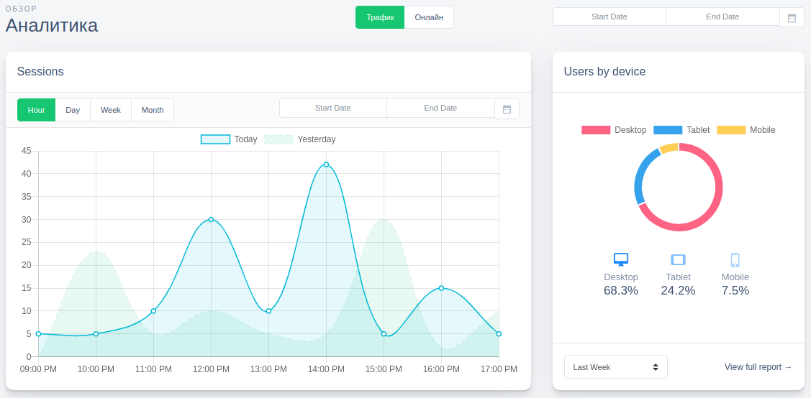

# ClickHouse Statistic Dashboard

A client application written in React for managers of statistics and analytics, as well as for administrators of the Yandex ClickHouse database

- [x] Nice and convenient application structure and routing
    - [x] Layouts
    - [x] SubLayouts  
    - [x] Pages
        - [x] Local components
    - [x] Components
        - [x] Quickstart
            - [x] UI/UX (Bootstrap) components
            - [x] Error Boundaries
            - [x] Content Loaders/Preloaders
        - [x] and more
    - [x] Containers
    - [x] Utilities
- [x] Flexible system of authentication, authorization and separation of user rights based on roles and permissions
    - [x] JWT auntification
    - [x] Base Form (FormBased) authorization
    - [ ] OAuth 2.0
    - [x] RBAC
    - [ ] Various user session repositories
- [x] Chart.js 
- [ ] Creating [tabbix](https://tabix.io)-like functionality